# Container Orchestration CI/CD Pipeline

## 1. Project Overview

This project implements a complete **CI/CD pipeline for a MERN-based microservices application** using Jenkins, Docker, Amazon ECR, Amazon EKS, and Kubernetes.

The pipeline automates the complete application lifecycle:

```text
Developer
   |
   | Git Push
   v
GitHub
   |
   | Webhook
   v
Jenkins
   |
   +---- CI ----> Build Docker Images
   |                  |
   |                  v
   |              Amazon ECR
   |
   +---- CD ----> Amazon EKS
                      |
                      v
                  Kubernetes
                      |
                      v
                  Application
```

The final implementation supports:

* Automated CI using Jenkins
* Docker image creation
* Amazon ECR image storage
* Dynamic image versioning using Jenkins `BUILD_NUMBER`
* Automated CD to Amazon EKS
* Kubernetes Deployments, Services, Ingress and HPA
* AWS Secrets Manager integration
* Secrets Store CSI Driver
* EKS Pod Identity
* Amazon Load Balancer Controller
* EKS Access Entry for Jenkins
* Kubernetes RBAC for Jenkins
* Automated rollout validation
* GitHub Webhook-triggered deployments

---

# 2. Application Architecture

The application consists of three main components:

```text
                       Internet
                           |
                           v
                    Application Load
                       Balancer
                           |
                           v
               AWS Load Balancer Controller
                           |
                           v
                    Kubernetes Ingress
                           |
              +------------+------------+
              |                         |
              v                         v
          Frontend                  Backend Services
                                      |
                           +----------+----------+
                           |                     |
                           v                     v
                    Hello Service        Profile Service
                                                |
                                                v
                                      AWS Secrets Manager
                                                |
                                                v
                                          MongoDB Atlas
```

### Application Components

| Component                    | Technology                  | Purpose                                                          |
| ---------------------------- | --------------------------- | ---------------------------------------------------------------- |
| Frontend                     | React                       | User interface                                                   |
| Hello Service                | Node.js / Express           | Backend service                                                  |
| Profile Service              | Node.js / Express / MongoDB | User/profile operations                                          |
| Ingress                      | Kubernetes                  | Defines external HTTP/HTTPS routing                              |
| Application Load Balancer    | AWS                         | External entry point for application traffic                     |
| AWS Load Balancer Controller | Kubernetes/AWS              | Creates and manages AWS Load Balancers from Kubernetes resources |
| HPA                          | Kubernetes                  | Automatic Pod scaling                                            |
| AWS Secrets Manager          | AWS                         | Secure secret storage                                            |
| Secrets Store CSI Driver     | Kubernetes                  | Makes AWS secrets available to Pods                              |

---

# 3. Repository Structure

The project follows this structure:

```text
.
├── Jenkinsfile
│
├── frontend/
│   ├── Dockerfile
│   └── ...
│
├── backend/
│   ├── helloService/
│   │   ├── Dockerfile
│   │   └── ...
│   │
│   └── profileService/
│       ├── Dockerfile
│       └── ...
│
└── infrastructure/
    └── eks/
        ├── manifests/
        │   ├── frontend-deployment.yaml
        │   ├── frontend-service.yaml
        │   ├── frontend-hpa.yaml
        │   ├── hello-service-deployment.yaml
        │   ├── hello-service-service.yaml
        │   ├── hello-service-hpa.yaml
        │   ├── profile-service-deployment.yaml
        │   ├── profile-service-service.yaml
        │   ├── profile-service-hpa.yaml
        │   ├── profile-secrets.yaml
        │   └── ingress.yaml
        │
        └── rbac/
            ├── jenkins-secretproviderclass-role.yaml
            └── jenkins-secretproviderclass-binding.yaml
```

The `manifests` directory contains application deployment configuration.

The `rbac` directory contains Jenkins Kubernetes authorization configuration.

This separation keeps **application configuration** and **deployment-platform security configuration** independent.

---

# 4. AWS Region and EKS Cluster

The application is deployed to:

```text
AWS Region:
us-east-1

EKS Cluster:
container-orch-cluster
```

The EKS cluster provides the Kubernetes control plane and worker nodes required to run the application.

---

# 5. Amazon ECR Repositories

Three Amazon ECR repositories are used:

```text
streaming-frontend
streaming-hello-service
streaming-profile-service
```

Each application component has its own Docker image repository.

The flow is:

```text
Application Source
       |
       v
Docker Build
       |
       v
Docker Image
       |
       v
Amazon ECR
```

ECR acts as the centralized container image registry from which Kubernetes pulls the application images.

---

# 6. Jenkins Setup

Jenkins is running locally inside a Docker container.

The Jenkins container is configured with access to Docker so that Jenkins can build application images.

The Jenkins environment contains the tools required by the pipeline:

```text
Docker
AWS CLI
Git
kubectl
```

`kubectl` is required because the CD portion of the pipeline communicates directly with the EKS cluster.

Verify the Kubernetes client:

```bash
kubectl version --client
```

---

# 7. Jenkins AWS Credentials

AWS credentials are stored securely in Jenkins rather than hardcoded into the Jenkinsfile.

The Jenkins credential ID used by the pipeline is:

```text
aws-ecr-credentials
```

The Jenkinsfile retrieves the credentials using Jenkins Credentials Binding:

```groovy
withCredentials([
    usernamePassword(
        credentialsId: env.AWS_CREDENTIALS_ID,
        usernameVariable: 'AWS_ACCESS_KEY_ID',
        passwordVariable: 'AWS_SECRET_ACCESS_KEY'
    )
])
```

This allows Jenkins to authenticate with AWS while keeping the actual access key and secret key outside the source code.

---

# 8. Jenkins IAM User

The AWS credentials used by Jenkins correspond to:

```text
IAM User:
jenkins-ecr-user
```

This IAM identity is responsible for allowing Jenkins to interact with AWS services required by the pipeline.

The permissions are intentionally separated into:

```text
AWS IAM permissions
        +
EKS access permissions
        +
Kubernetes RBAC permissions
```

This provides a clear authorization model.

---

# 9. IAM Permission for EKS Cluster Discovery

Before Jenkins can communicate with Kubernetes, it needs to obtain the EKS cluster configuration.

Jenkins uses:

```bash
aws eks update-kubeconfig \
  --region us-east-1 \
  --name container-orch-cluster
```

AWS must therefore allow the Jenkins IAM identity to perform:

```text
eks:DescribeCluster
```

An **inline IAM policy** containing the required `eks:DescribeCluster` permission is attached to:

```text
jenkins-ecr-user
```

### Significance

This is an **AWS IAM permission**.

It allows Jenkins to discover the EKS cluster endpoint and certificate information required to create/update the kubeconfig.

It does **not** by itself give Jenkins permission to create Kubernetes resources.

The distinction is:

```text
eks:DescribeCluster
        |
        v
AWS allows Jenkins to discover the EKS cluster
```

Then Kubernetes authorization is handled separately.

---

# 10. EKS Access Entry for Jenkins

An EKS Access Entry is configured for:

```text
arn:aws:iam::533612070969:user/jenkins-ecr-user
```

### Why is this required?

The Jenkins IAM identity exists in AWS, but Kubernetes also needs to recognize that AWS identity when Jenkins connects to the EKS API server.

The EKS Access Entry establishes the relationship between the AWS IAM principal and access to the EKS cluster.

Conceptually:

```text
AWS IAM User
      |
      v
EKS Access Entry
      |
      v
Kubernetes Identity
```

The Jenkins principal is represented in Kubernetes as:

```text
arn:aws:iam::533612070969:user/jenkins-ecr-user
```

This provides the foundation for controlling Jenkins' Kubernetes permissions.

---

# 11. AmazonEKSEditPolicy

The Jenkins IAM principal is associated with:

```text
AmazonEKSEditPolicy
```

with access scoped to the:

```text
default
```

namespace.

### Why?

The CI/CD pipeline needs to manage application resources inside Kubernetes.

The namespace-scoped edit access allows Jenkins to perform normal application deployment operations such as managing:

```text
Deployments
Services
HorizontalPodAutoscalers
Ingress
```

The access is scoped to the application namespace rather than unnecessarily granting broad cluster-wide administrative access.

### Authorization model

```text
Jenkins IAM User
       |
       v
EKS Access Entry
       |
       v
AmazonEKSEditPolicy
       |
       v
Application namespace
```

---

# 12. Kubernetes RBAC for SecretProviderClass

The application uses the AWS Secrets Store CSI Driver.

One of the resources created by the driver is:

```text
SecretProviderClass
```

Its API group is:

```text
secrets-store.csi.x-k8s.io
```

The application uses:

```text
profile-service-secrets
```

as its `SecretProviderClass`.

Although Jenkins has normal namespace-level edit access, custom resources can require explicit Kubernetes RBAC permissions.

Therefore a dedicated Kubernetes Role is created for Jenkins.

---

# 13. Understanding the SecretProviderClass CRD

`SecretProviderClass` is a Kubernetes custom resource.

CRD stands for:

```text
Custom Resource Definition
```

It extends Kubernetes with additional resource types.

For this application:

```text
API Group:
secrets-store.csi.x-k8s.io

Resource:
secretproviderclasses
```

The application manifest contains:

```yaml
apiVersion: secrets-store.csi.x-k8s.io/v1
kind: SecretProviderClass
```

This resource defines how the application obtains secrets from AWS Secrets Manager.

---

# 14. Jenkins Kubernetes Role

The Jenkins Role defines what Jenkins is allowed to do with `SecretProviderClass`.

The Role contains permissions for:

```text
get
list
watch
create
update
patch
delete
```

against:

```text
secretproviderclasses
```

in the:

```text
secrets-store.csi.x-k8s.io
```

API group.

### Significance

The Role answers:

> **What can Jenkins do?**

Conceptually:

```text
Role
 |
 +-- API Group
 |     secrets-store.csi.x-k8s.io
 |
 +-- Resource
 |     secretproviderclasses
 |
 +-- Actions
       get
       list
       watch
       create
       update
       patch
       delete
```

---

# 15. Jenkins RoleBinding

A Kubernetes RoleBinding connects the Jenkins Kubernetes identity to the Role.

The binding assigns:

```text
User:
arn:aws:iam::533612070969:user/jenkins-ecr-user
```

to:

```text
Role:
jenkins-secretproviderclass-role
```

### Significance

The RoleBinding answers:

> **Who receives these permissions?**

Therefore:

```text
Jenkins User
      |
      v
RoleBinding
      |
      v
jenkins-secretproviderclass-role
      |
      v
SecretProviderClass permissions
```

This is Kubernetes **RBAC**.

RBAC stands for:

```text
Role-Based Access Control
```

---

# 16. RBAC vs IAM

AWS IAM and Kubernetes RBAC serve different purposes.

### AWS IAM

Controls what an AWS identity can do in AWS.

```text
IAM User
   |
   v
IAM Policy
   |
   v
AWS permissions
```

Example:

```text
eks:DescribeCluster
```

### Kubernetes RBAC

Controls what an identity can do inside Kubernetes.

```text
Kubernetes User
      |
      v
RoleBinding
      |
      v
Role
      |
      v
Kubernetes resources
```

Example:

```text
SecretProviderClass
```

Both authorization systems are required because Jenkins interacts with both AWS and Kubernetes.

---

# 17. AWS Secrets Manager and Secrets Store CSI Driver

Sensitive configuration is stored in **AWS Secrets Manager** rather than directly inside Git.

The Profile Service uses:

```text
streaming/profile-service/mongo-url
```

as the AWS Secrets Manager secret.

The secret contains the MongoDB connection information.

The application does not store the MongoDB connection string directly in the Kubernetes Deployment YAML.

Instead, the secret retrieval process is handled through the **Secrets Store CSI Driver** and a Kubernetes `SecretProviderClass`.

The complete flow is:

```text
AWS Secrets Manager
        |
        | Secret
        v
Secrets Store CSI Driver
        |
        v
SecretProviderClass
        |
        v
Profile Service Pod
```

### SecretProviderClass

The `SecretProviderClass` acts as the configuration object that tells the Secrets Store CSI Driver:

* Which AWS secret should be retrieved
* Which AWS Secrets Manager object type is being used
* What local/object alias should be used
* Which Kubernetes Secret should be created/synchronized

The configuration contains the AWS Secrets Manager object:

```text
streaming/profile-service/mongo-url
```

and maps it to:

```text
MONGO_URL
```

The Kubernetes Secret created/synchronized for the application is:

```text
profile-service-secret
```

with:

```text
MONGO_URL
```

as the key.

### Why use this approach?

Instead of:

```text
Git
 |
 +-- MongoDB connection string
```

we use:

```text
Git
 |
 +-- SecretProviderClass configuration
 |
 v
AWS Secrets Manager
 |
 +-- Actual secret value
```

This keeps sensitive values outside the source repository.

### Jenkins access to SecretProviderClass

The Jenkins deployment pipeline must also be able to manage the `SecretProviderClass` resource when executing:

```bash
kubectl apply -f infrastructure/eks/manifests
```

Because `SecretProviderClass` belongs to the custom API group:

```text
secrets-store.csi.x-k8s.io
```

dedicated Kubernetes RBAC was configured for the Jenkins identity.

Therefore there are two separate permission concerns:

```text
Jenkins
 |
 +--> Kubernetes RBAC
 |       |
 |       +--> Manage SecretProviderClass
 |
 +--> AWS IAM / EKS access
         |
         +--> Access EKS
```

The application itself later accesses AWS Secrets Manager through its Pod Identity configuration.

---

# 18. Amazon Load Balancer Controller

The **AWS Load Balancer Controller (ALBC)** is installed in the EKS cluster to integrate Kubernetes with AWS Elastic Load Balancing.

Its primary responsibility in this project is to watch Kubernetes resources such as `Ingress` and automatically create and manage the corresponding AWS Application Load Balancer.

The architecture is:

```text
Kubernetes Ingress
        |
        | watched by
        v
AWS Load Balancer Controller
        |
        | AWS API calls
        v
Application Load Balancer
```

### ServiceAccount for ALBC

The AWS Load Balancer Controller runs inside Kubernetes using its own Kubernetes ServiceAccount.

The ServiceAccount is associated with an AWS IAM role.

This allows the controller Pods to make the AWS API calls required to create and manage load-balancing resources.

### OIDC and IRSA

For the AWS Load Balancer Controller, we configured the EKS cluster's **OIDC provider** and used **IAM Roles for Service Accounts (IRSA)**.

The authorization flow is:

```text
ALBC Pod
   |
   v
ALBC ServiceAccount
   |
   v
OIDC Provider
   |
   v
IAM Role
   |
   v
IAM Policy
   |
   v
AWS Elastic Load Balancing APIs
```

The ServiceAccount is therefore the Kubernetes identity used by the Load Balancer Controller.

The IAM role associated with this ServiceAccount contains the permissions required by the controller to manage AWS load-balancing resources.

### Why is this required?

The ALBC needs AWS permissions to perform operations such as:

```text
Create Load Balancer
Create Target Group
Create Listener
Create Listener Rules
Register Targets
Modify Load Balancer configuration
Delete/Update Load Balancer resources
```

Without AWS authorization, Kubernetes could have an Ingress object, but the controller would not be able to create the corresponding AWS load balancer.

### Important distinction

The ALBC ServiceAccount is **not** the same as:

```text
profile-service
```

The identities serve different purposes:

```text
ALBC ServiceAccount
        |
        v
AWS Load Balancer Controller
        |
        v
AWS Load Balancer APIs


profile-service ServiceAccount
        |
        v
Profile Service Pods
        |
        v
AWS Secrets Manager
```

The ALBC ServiceAccount is for the **infrastructure controller**.

The Profile Service ServiceAccount is for the **application workload**.

---

# 19. EKS Pod Identity

EKS Pod Identity is used to provide AWS permissions directly to application Pods without placing AWS access keys inside the containers.

For this project, the EKS Pod Identity capability/add-on was installed and configured for the cluster.

The Profile Service uses the Kubernetes ServiceAccount:

```yaml
serviceAccountName: profile-service
```

This ServiceAccount is associated with an AWS IAM role through an **EKS Pod Identity Association**.

The IAM role has the required permission to access AWS Secrets Manager.

The complete flow is:

```text
Profile Service Pod
        |
        v
ServiceAccount
profile-service
        |
        v
EKS Pod Identity Association
        |
        v
AWS IAM Role
        |
        v
IAM Policy
        |
        v
AWS Secrets Manager
        |
        v
streaming/profile-service/mongo-url
```

### Why EKS Pod Identity?

The application should not contain:

```text
AWS_ACCESS_KEY_ID
AWS_SECRET_ACCESS_KEY
```

inside the Pod.

Instead, AWS identity is provided through the Kubernetes ServiceAccount and EKS Pod Identity.

This gives the application temporary AWS credentials associated with the IAM role.

### IAM Role and Policy

An IAM role was created specifically for the Profile Service workload.

The role is associated with the Kubernetes ServiceAccount:

```text
profile-service
```

The IAM policy attached to the role grants the permissions required to retrieve the application's secret from AWS Secrets Manager.

Conceptually:

```text
IAM Policy
    |
    | Allows required Secrets Manager actions
    v
IAM Role
    |
    | Associated with
    v
profile-service ServiceAccount
    |
    v
Profile Service Pod
```

### Why this is different from Jenkins IAM

Jenkins and the application have completely different identities and responsibilities.

```text
Jenkins
 |
 +--> IAM User
 |      |
 |      +--> EKS access
 |      +--> ECR access
 |      +--> Kubernetes deployment permissions
 |
 v
Deploys application


Profile Service
 |
 +--> Kubernetes ServiceAccount
        |
        +--> EKS Pod Identity
                |
                +--> IAM Role
                        |
                        +--> Secrets Manager access
```

Jenkins needs permission to **deploy** the application.

The Profile Service needs permission to **read its runtime secret**.

These permissions are intentionally separated.

---

# 20. Kubernetes Deployments

The application is deployed using Kubernetes Deployment resources.

There are three primary Deployments:

```text
frontend
hello-service
profile-service
```

Deployments manage the desired number of Pods and perform rolling updates when the container image changes.

---

# 21. Kubernetes Services

Each application component has a Kubernetes Service.

Services provide stable networking for the Pods even when Pods are recreated.

The architecture is:

```text
Service
   |
   +---- Pod
   +---- Pod
   +---- Pod
```

Kubernetes automatically routes traffic to the appropriate healthy Pods.

---

# 22. Kubernetes Ingress and Application Load Balancer

The Kubernetes Ingress defines how external HTTP/HTTPS traffic should be routed into the application.

In this project, the Ingress is integrated with the **AWS Load Balancer Controller**.

The complete traffic flow is:

```text
Internet / Browser
        |
        v
Application Load Balancer
        |
        v
AWS Load Balancer Controller
        |
        v
Kubernetes Ingress
        |
        v
Kubernetes Service
        |
        v
Application Pods
```

### How the ALB is created

The ALB is not manually created for the application.

The Kubernetes Ingress contains the required AWS Load Balancer Controller configuration.

The AWS Load Balancer Controller watches the Ingress resource.

When it detects the Ingress, it communicates with AWS APIs and creates the required:

```text
Application Load Balancer
Target Group
Listener
Listener Rules
```

The resulting architecture is:

```text
Kubernetes Ingress
       |
       | interpreted by
       v
AWS Load Balancer Controller
       |
       | creates/manages
       v
AWS Application Load Balancer
```

### Target Type: IP

The Ingress is configured to use:

```text
target-type: ip
```

With IP target mode, the ALB target groups use the **Pod IP addresses** as targets.

Therefore traffic can flow directly from the ALB to the application Pods rather than requiring the ALB to target the EC2 worker nodes first.

Conceptually:

```text
Internet
   |
   v
ALB
   |
   +------------------+
   |                  |
   v                  v
Pod IP              Pod IP
Frontend            Frontend
```

For backend services, the same model allows traffic to ultimately reach the appropriate application Pods through the Kubernetes networking configuration.

### Why IP target mode is useful

The Pods are the actual application workloads.

When Kubernetes creates, removes, or replaces Pods, their IP addresses can change.

The AWS Load Balancer Controller continuously reconciles the Kubernetes state with the AWS load balancer configuration and keeps the target groups synchronized with the current workload.

This becomes especially important when HPA changes the number of Pods.

For example:

```text
Initial state:

ALB
 |
 +--> Pod 1
 +--> Pod 2


Traffic increases

        HPA
         |
         v
Pod 3 created


Controller updates target registration

ALB
 |
 +--> Pod 1
 +--> Pod 2
 +--> Pod 3
```

When Pods are removed during scaling or rolling deployment, the corresponding targets are also reconciled.

### Ingress is the routing configuration

The Ingress itself does not create the AWS ALB.

The responsibilities are:

```text
Ingress
   |
   | Defines desired routing
   v
AWS Load Balancer Controller
   |
   | Implements that routing in AWS
   v
Application Load Balancer
```

This distinction is important when troubleshooting.

If the Ingress exists but no ALB is created, the AWS Load Balancer Controller and its AWS permissions should be checked.

---

# 23. Horizontal Pod Autoscaler

HPA is configured for:

```text
frontend
hello-service
profile-service
```

The configuration uses:

```text
Minimum replicas: 2
Maximum replicas: 4
CPU target: 70%
```

The HPA automatically adjusts the number of Pods based on CPU utilization.

Example:

```text
Low CPU
   |
   v
2 Pods

High CPU
   |
   v
3 Pods
   |
   v
4 Pods
```

CPU resource requests are defined in the Deployment because HPA CPU utilization is calculated relative to the requested CPU.

---

# 24. CI Pipeline

The CI pipeline performs the following steps.

## Step 1 — Checkout

Jenkins checks out the source code from GitHub.

```groovy
checkout scm
```

---

## Step 2 — Resolve AWS Account and ECR Registry

The pipeline dynamically obtains the AWS account ID:

```bash
aws sts get-caller-identity
```

The ECR registry is then constructed dynamically.

No AWS account ID is hardcoded in the Jenkinsfile.

---

## Step 3 — Build Frontend Image

Jenkins builds the frontend Docker image from:

```text
frontend/
```

---

## Step 4 — Build Hello Service Image

Jenkins builds the Hello Service image from:

```text
backend/helloService/
```

---

## Step 5 — Build Profile Service Image

Jenkins builds the Profile Service image from:

```text
backend/profileService/
```

---

# 25. Dynamic Docker Image Versioning

Each Jenkins build receives a unique Jenkins build number.

The pipeline uses:

```text
BUILD_NUMBER
```

as the Docker image version.

For example:

```text
Jenkins Build #27
```

produces:

```text
streaming-frontend:27
streaming-hello-service:27
streaming-profile-service:27
```

The number is generated dynamically by Jenkins.

The Jenkinsfile does not contain:

```text
:27
:28
:29
```

or any manually maintained version.

### Significance

Every deployment can be traced back to a specific Jenkins build.

For example:

```text
Production image
        |
        v
Build #27
        |
        v
Git commit associated with Build #27
```

This provides basic deployment traceability and makes rollback to a previous build version possible.

---

# 26. Login to Amazon ECR

Jenkins authenticates with Amazon ECR using the AWS credentials stored in Jenkins.

The pipeline uses:

```bash
aws ecr get-login-password
```

and:

```bash
docker login
```

This allows Jenkins to push the newly built images into ECR.

---

# 27. Push Images to ECR

The versioned images are pushed to:

```text
533612070969.dkr.ecr.us-east-1.amazonaws.com
```

using the dynamically generated repository and build tag.

Conceptually:

```text
Docker Build
     |
     v
Image :BUILD_NUMBER
     |
     v
ECR
```

---

# 28. CD Pipeline

After CI successfully pushes the images, the CD process begins.

The deployment sequence is:

```text
Build
  |
  v
Push Images to ECR
  |
  v
Configure kubectl for EKS
  |
  v
Apply Kubernetes Manifests
  |
  v
Set Exact Image Version
  |
  v
Rollout
  |
  v
Validate
```

This ensures that the image created by the CI process is the image deployed by CD.

---

# 29. Configure kubectl for EKS

Jenkins configures its Kubernetes context using:

```bash
aws eks update-kubeconfig \
  --region us-east-1 \
  --name container-orch-cluster
```

This creates the Kubernetes context inside the Jenkins container.

The context can be verified with:

```bash
kubectl config current-context
```

---

# 30. Apply Kubernetes Manifests

Jenkins applies the application manifests:

```bash
kubectl apply -f infrastructure/eks/manifests
```

This applies the application configuration, including:

```text
Deployments
Services
HPA
Ingress
SecretProviderClass
```

The manifest directory does not contain the Jenkins RBAC configuration.

The Jenkins RBAC resources are platform/security configuration and are maintained separately under:

```text
infrastructure/eks/rbac/
```

---

# 31. Set the Exact Jenkins Build Image

The Deployment YAML contains the base image configuration.

The CD pipeline then explicitly sets the image generated by the current Jenkins build.

For example:

```bash
kubectl set image deployment/frontend \
  frontend=${FRONTEND_IMAGE}:${BUILD_NUMBER}
```

The same process is performed for:

```text
hello-service
profile-service
```

### Why?

The image produced by CI is:

```text
streaming-frontend:BUILD_NUMBER
```

Therefore CD must deploy that exact version rather than depending on a mutable `latest` tag.

The final Deployment points to the exact image generated by the current Jenkins build.

---

# 32. Kubernetes Rolling Update

When `kubectl set image` changes the Deployment image, Kubernetes detects that the desired Pod template has changed.

The Deployment controller then performs a rolling update.

Conceptually:

```text
Old Pods
   |
   | New image specified
   v
Kubernetes Deployment
   |
   v
New Pods created
   |
   v
Old Pods gradually removed
   |
   v
New version running
```

This allows the application to be updated without manually deleting all existing Pods.

---

# 33. Rollout Status

The pipeline uses:

```bash
kubectl rollout status deployment/frontend --timeout=300s
```

and equivalent commands for the other Deployments.

`kubectl rollout status` does not start a second deployment.

It monitors the Deployment rollout that Kubernetes is already performing.

The pipeline waits until Kubernetes reports that the new Pods are successfully rolled out.

---

# 34. Deployment Validation

After the rollout, Jenkins validates the Kubernetes deployment.

Typical validation commands include:

```bash
kubectl get deployments -n default
kubectl get pods -n default
kubectl get services -n default
kubectl get hpa -n default
```

Expected state:

```text
Frontend             READY
Hello Service        READY
Profile Service      READY
```

The pipeline is considered successful only after the deployment and rollout checks complete successfully.

---

# 35. GitHub Webhook Automation

The final stage is automatic pipeline triggering.

Because Jenkins is running locally, GitHub cannot directly reach:

```text
localhost:8080
```

ngrok is used to expose the local Jenkins instance.

Start ngrok:

```bash
ngrok http 8080
```

ngrok provides a public HTTPS endpoint.

The GitHub webhook is configured with:

```text
https://<ngrok-url>/github-webhook/
```

Jenkins is configured with:

```text
GitHub hook trigger for GITScm polling
```

The GitHub webhook listens for push events.

---

# 36. Final Automated Workflow

After webhook configuration, the complete process becomes:

```text
Developer
    |
    | git push
    v
GitHub
    |
    | Webhook
    v
Jenkins
    |
    v
Checkout
    |
    v
Build Docker Images
    |
    v
Dynamic BUILD_NUMBER
    |
    v
Push Images to ECR
    |
    v
Configure kubectl
    |
    v
Apply Kubernetes Manifests
    |
    v
Set Exact Build Image
    |
    v
Rolling Update
    |
    v
Rollout Validation
    |
    v
Kubernetes Validation
    |
    v
Application Updated
```

No manual **Build Now** action is required after the webhook is working.

---

# 37. Testing


## Refer the complete, formatted, readable CI CD pipeline log file in 'pipeline-log' folder (jenkins-pipeline-log.pdf)


## AWS EKS Cluster

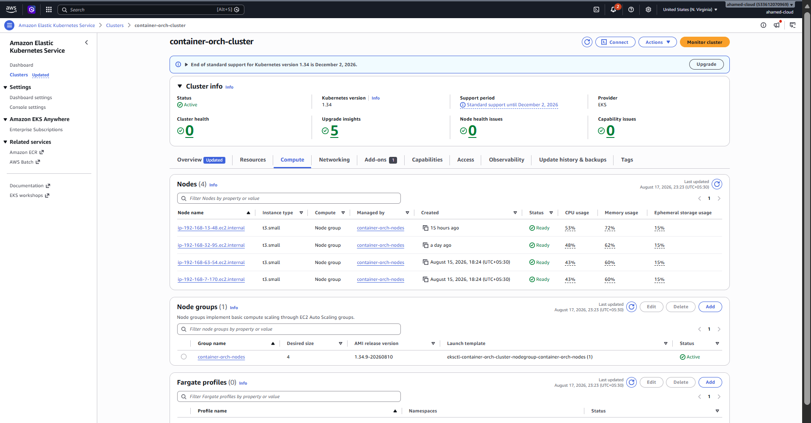


-------------------------------------------------


## AWS ECR repositories

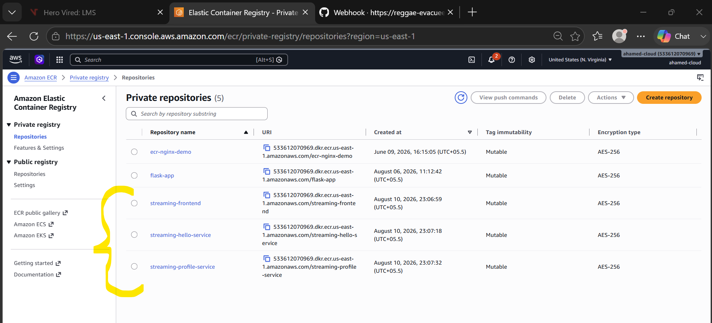

-------------------------------------------------

### frontend repo image

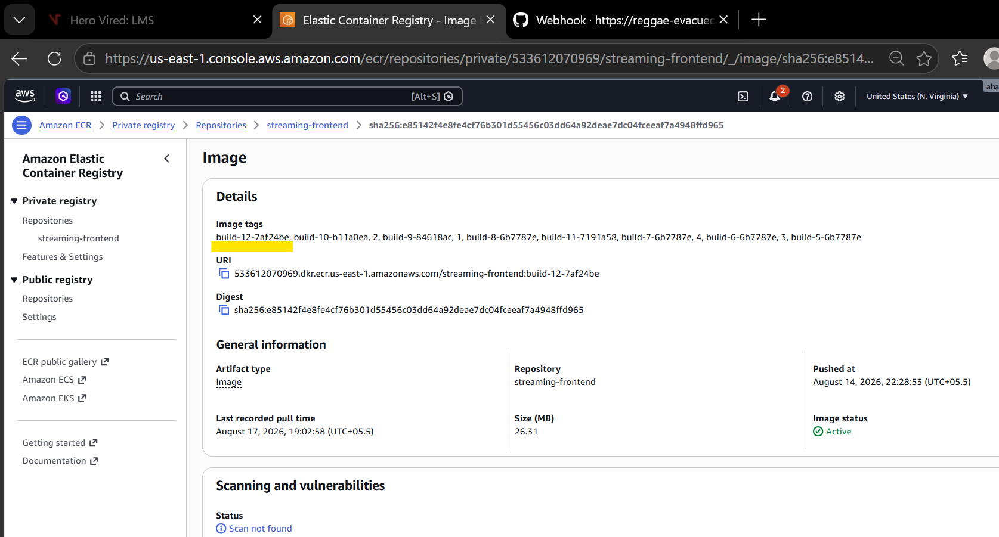

-------------------------------------------------

### hello-service repo image

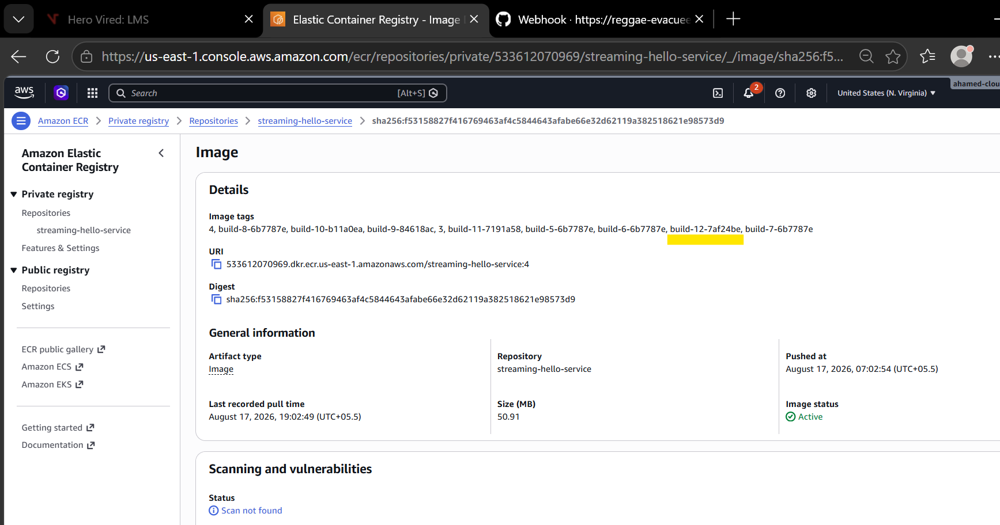

-------------------------------------------------

### profile-service repo image

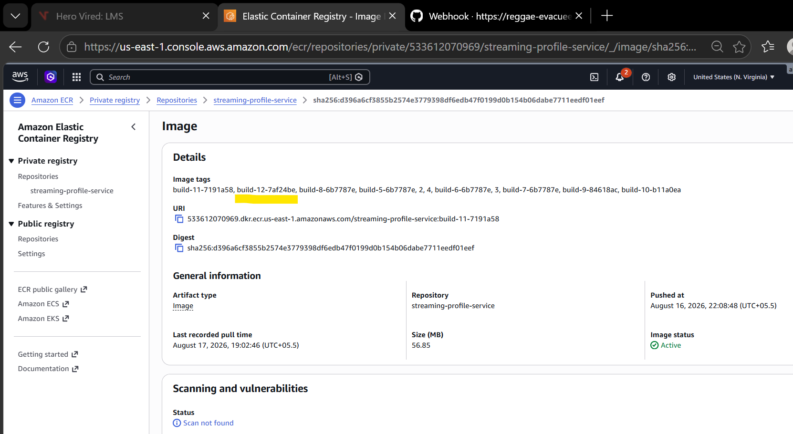


-------------------------------------------------

## AWS Secrets Manager

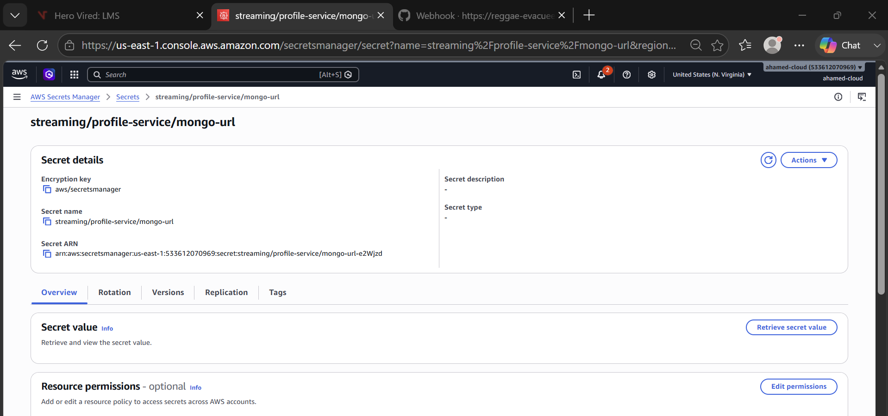


-------------------------------------------------


## Check EKS Nodes

```bash
kubectl get nodes
```
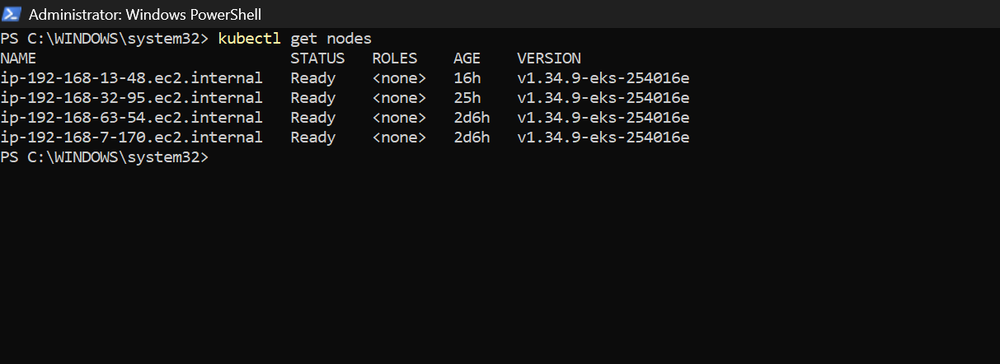

## Check Pods

```bash
kubectl get pods
```

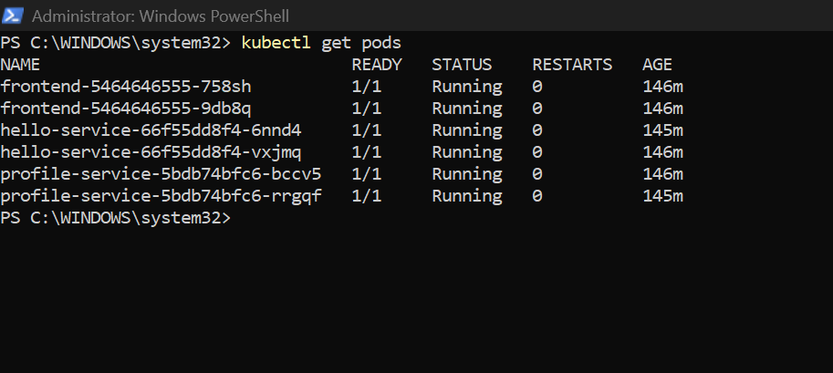

## Check Deployments

```bash
kubectl get deployments
```
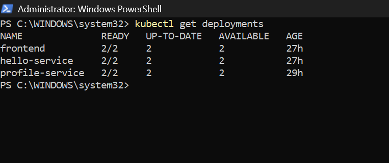

## Check Services

```bash
kubectl get services
```
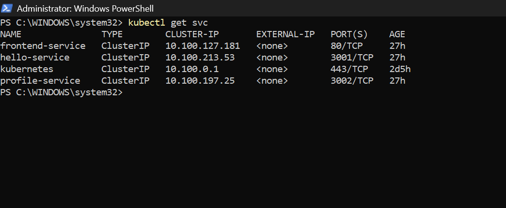


## Check HPA

```bash
kubectl get hpa
```

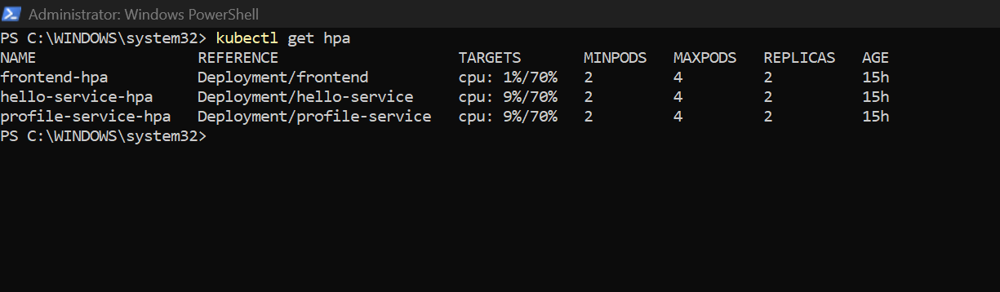


## Check Ingress

```bash
kubectl get ingress
```
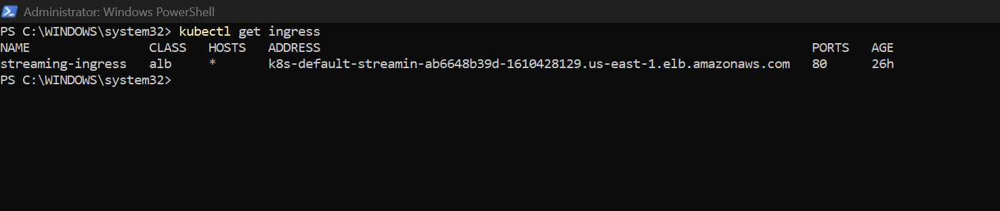


## Check Resource Usage

```bash
kubectl top pods
```
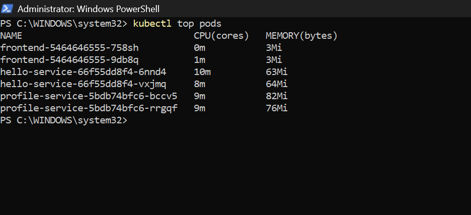


## Check Cloud watch

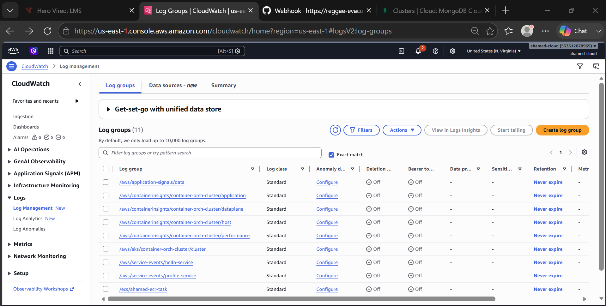

## Check logs in Cloud watch. eg: hello-service

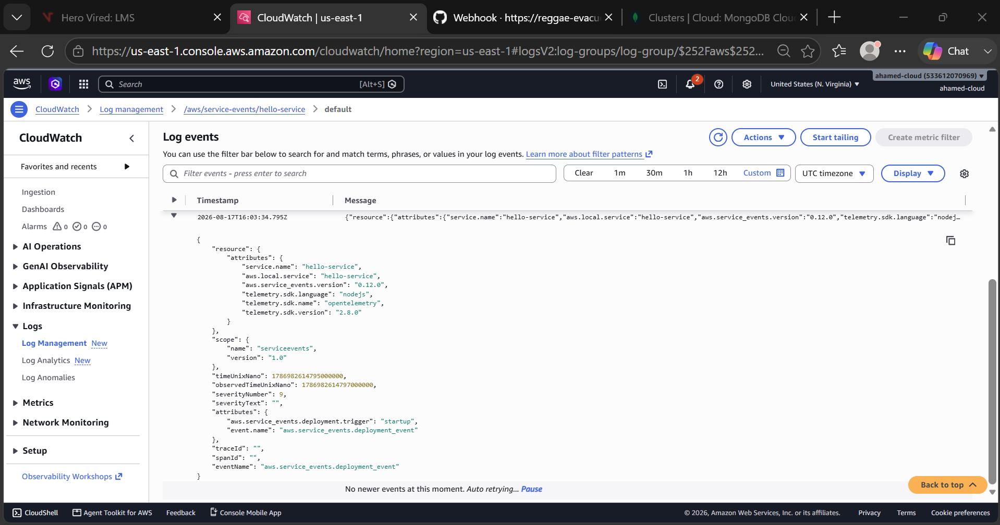


## Webhook

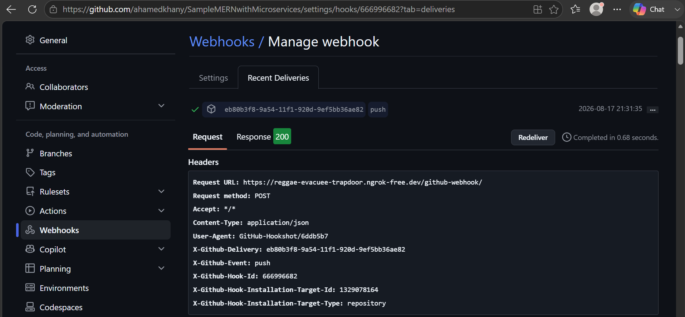


## Commit the code in repo and check pipeline

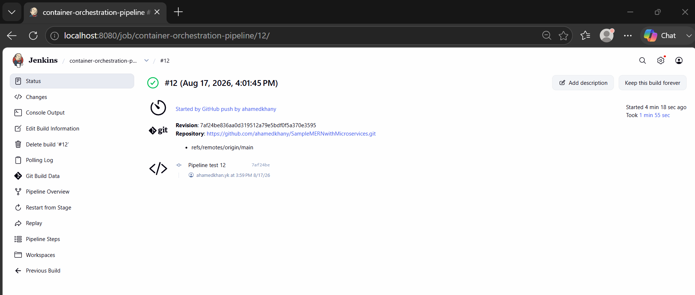

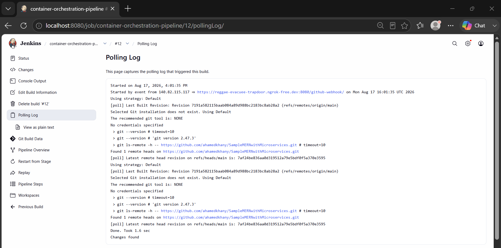

### Pipeline screenshots

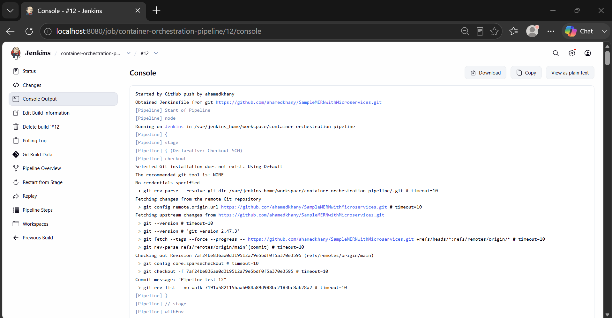

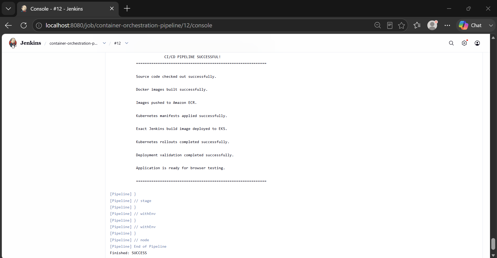


----------------------------------------------------------


# Finally, access the application through the configured Application Load Balancer/Ingress endpoint in a browser.

## Open Browser and run using Load Balancer DNS name provided in ingress

### Welcome frontend page

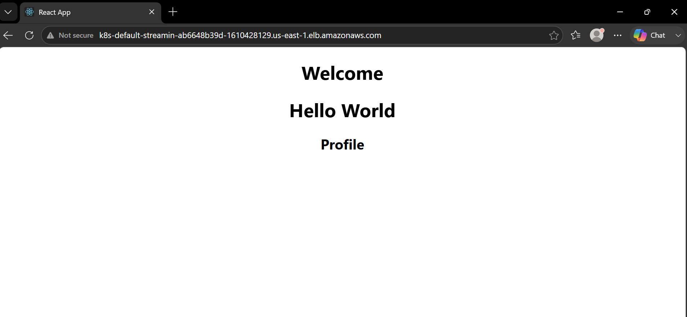

----------------------------------------------------------

### hello-service

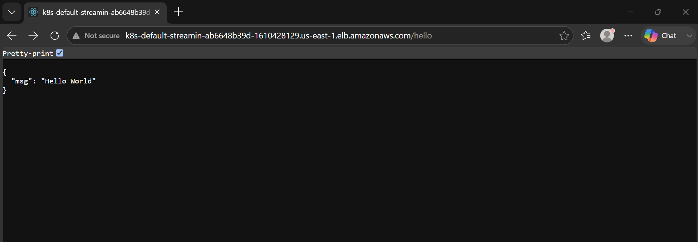

----------------------------------------------------------

### profile-service

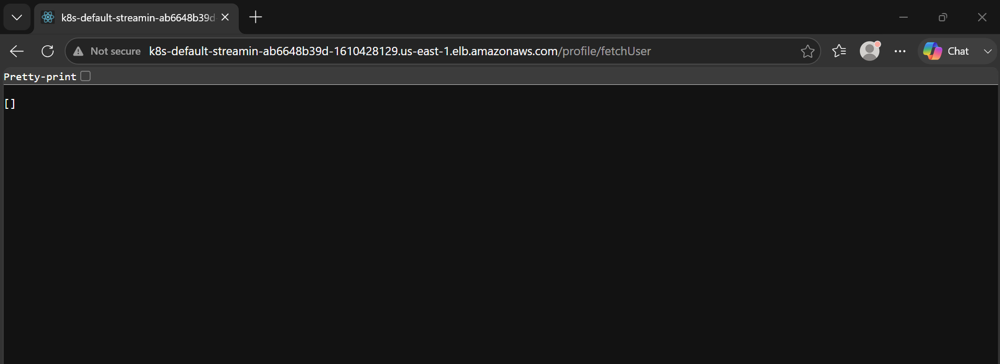


----------------------------------------------------------


---

# 38. Issues Faced and Resolutions

The following issues were encountered during implementation and resolved:

* **`eks:DescribeCluster` AccessDenied**

  * Added an inline IAM policy with `eks:DescribeCluster` to `jenkins-ecr-user`.

* **Jenkins could configure kubeconfig but Kubernetes access was not available**

  * Created an EKS Access Entry for `jenkins-ecr-user`.

* **Jenkins could not access certain Kubernetes resources**

  * Configured appropriate EKS namespace-level access using `AmazonEKSEditPolicy`.

* **`SecretProviderClass` access denied**

  * Created a Kubernetes Role for `secretproviderclasses` in the `secrets-store.csi.x-k8s.io` API group.

* **Role permissions were not applied to Jenkins**

  * Created a RoleBinding for `jenkins-ecr-user`.

* **HPA showed `cpu: <unknown>`**

  * Added CPU resource requests to the application containers.

* **`kubectl: not found` inside Jenkins**

  * Installed `kubectl` in the Jenkins container.

* **Kubernetes authentication failed from Jenkins**

  * Configured AWS credentials, EKS access, kubeconfig, and Kubernetes authorization correctly.

* **Deployment version was hardcoded**

  * Changed the pipeline to use Jenkins `BUILD_NUMBER` dynamically.

* **`latest` image could not reliably identify the Jenkins build**

  * CD now explicitly deploys the exact image version generated by the current Jenkins build.

* **Git LF/CRLF warning on Windows**

  * Identified as a Git line-ending warning rather than an application or Kubernetes failure.

---

# 39. Final Implementation

The completed project provides:

```text
+--------------------------------------------------+
|                 COMPLETE CI/CD                   |
+--------------------------------------------------+
|                                                  |
| GitHub                                           |
|    |                                             |
|    | Webhook                                     |
|    v                                             |
| Jenkins                                          |
|    |                                             |
|    +--> Docker Build                             |
|    |                                             |
|    +--> Dynamic BUILD_NUMBER                     |
|    |                                             |
|    +--> Amazon ECR                               |
|    |                                             |
|    +--> EKS kubeconfig                           |
|    |                                             |
|    +--> Kubernetes Manifest Apply                |
|    |                                             |
|    +--> Exact Image Deployment                   |
|    |                                             |
|    +--> Rolling Update                           |
|    |                                             |
|    +--> Rollout Validation                       |
|    |                                             |
|    +--> Application Validation                   |
|                                                  |
|                    EKS                           |
|                     |                            |
|        +------------+------------+               |
|        |                         |               |
|        v                         v               |
|   ALB / Ingress              Kubernetes         |
|        |                     Services            |
|        |                         |               |
|        +------------+------------+               |
|                     |                            |
|              +------+------+                     |
|              |      |      |                     |
|              v      v      v                     |
|          Frontend Hello  Profile                 |
|                         |                        |
|                         v                        |
|                 Secrets Manager                  |
|                                                  |
+--------------------------------------------------+
```

The implementation uses **dynamic image versioning, Amazon ECR, EKS Access Entry, AWS IAM, AmazonEKSEditPolicy, Kubernetes RBAC, Secrets Store CSI Driver, AWS Secrets Manager, EKS Pod Identity, Amazon Load Balancer Controller, OIDC/IRSA, Application Load Balancer, IP target mode, HPA, Kubernetes rolling deployments, Jenkins CD, and GitHub Webhooks** to provide a complete automated deployment workflow.
